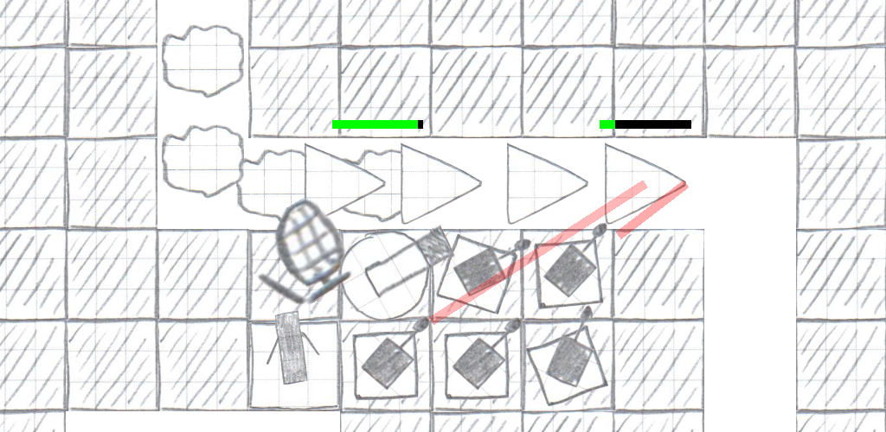

# Anuto - Another Ugly Tower Defense

Anuto is yet another tower defense game for Android.
However it features astonishing hand-drawn graphics and a smooth gameplay.

## Download

- [Google Play Store](https://play.google.com/store/apps/details?id=ch.logixisland.anuto)
- [F-Droid](https://f-droid.org/repository/browse/?fdid=ch.logixisland.anuto)

## Beta Testing

Become a [beta tester](https://play.google.com/apps/testing/ch.logixisland.anuto)!

## How to play

- Buy new towers by dragging a tower from the inventory at the top onto the field.
  Make sure you have enough credits.
- Open the properties window for a tower by double tapping it.
  To close the window tap somewhere on the field.
- Strategy: Determines which enemy to target if there are multiple in range.
- Lock Target: If true the tower will not switch target until it is dead or out of range.
- Enhance: Increases the level of the tower making it better.
- Upgrade: Replaces the tower with a higher tier tower.
  Note that any enhancements of the tower are lost.
- Sell: Removes the tower. Refund decreases over time.
- Call in the next wave using the button in the upper right corner.
  If you call in the next wave while there are still enemies in the game you receive bonus credits.
- Make sure the enemies don't make it through the course!
